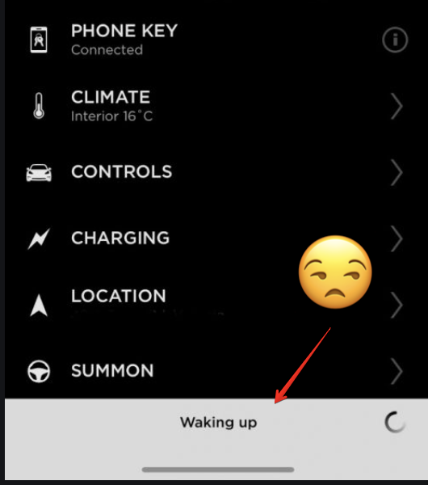

# Tesla Automation Scheduler
Schedule tasks and commands to control your Tesla vehicle via the Tesla API. This is the extension that you wish the Tesla app included!

## Overview

Have you ever wanted to ask your phone, `Hey Siri, Set the temperature of the car to 20 degrees`, or `Start the climate at 8 AM`? Or have you ever tried to turn on the climate control and had to wait for up to 30-seconds for your vehicle to wake up? If so, this is the app you need! 

## How It Works

The application listens for your requests. Once it receives your request, it sends it immediately or schedules it to the Tesla API.

## Architecture
### [TODO] 1 Terraform 

Infrastructure-as-code to automate deployment and ensure that deployment is deterministic.
### [TODO] 2 Kubernetes 

Container orchestration to ensure application is highly available and self-healing.

- OpenSSL to generate self-signed cert
- Secrets Manager (store secrets like tesla auth token)

### [TODO] 3 RabbitMQ/Amazon SQS 

Message queue service that accepts user requests and distributes them to worker node. Also used for scheduling of requests.

### [TODO] 4 Node.js Worker Node 

This is the heart of the application. It is a stateless app that receives requests, determines if they should be scheduled, sends them to RabbitMQ, and makes API requests to Tesla

- Need to decrypt auth token from queue 
- Send API requests to Tesla

### Tesla API

- Get Access Token https://www.teslaapi.io/authentication/oauth
  - actually, maybe have the token available cuz I don't wanna generate a new one each time
- Wake up https://owner-api.teslamotors.com/api/1/vehicles/:id/wake_up
- Set Temperature https://owner-api.teslamotors.com/api/1/vehicles:id/command/set_temps?driver_temp=:driver_temppassenger_temp=:passenger_temp
- Start charging https://owner-api.teslamotors.com/api/1/vehicles/:id/command/charge_start
- Stop charging https://owner-api.teslamotors.com/api/1/vehicles/:id/command/charge_stop

More info: https://tesla-api.timdorr.com/